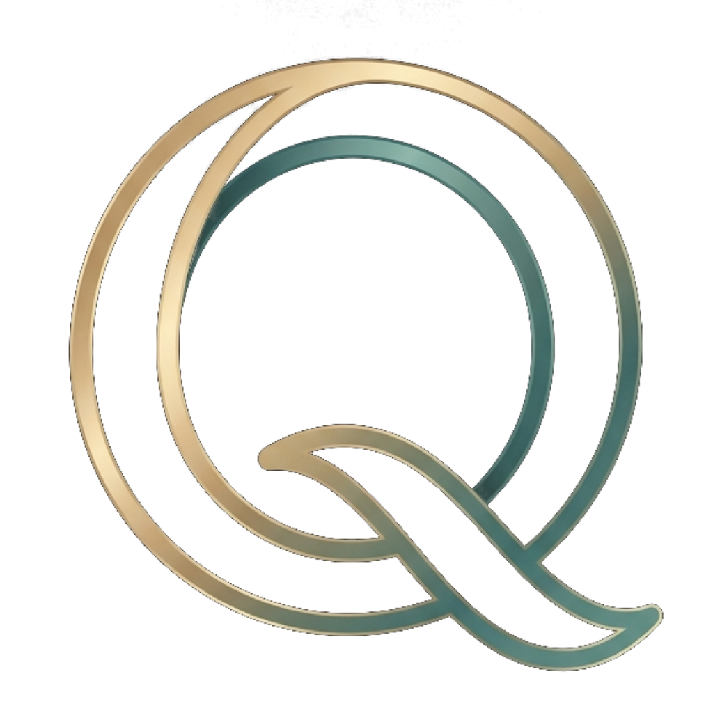

<div align="center">
  
  <h1>QBrowse</h1>
  <p><strong>Next-Generation Privacy Browser with Integrated Tor Onion Routing, Local Gemma AI & Encrypted Cloud Sync</strong></p>

  [](LICENSE)
  [](https://github.com/Qu-Bi/QBrowse/actions/workflows/build-linux.yml)
</div>

---

## Overview

**QBrowse** is a modern, privacy-first desktop web browser built with Electron, React, and Vite. Designed from the ground up for security enthusiasts and privacy-conscious users, QBrowse combines high-performance browsing with native Tor onion routing, on-device neural language models, and zero-knowledge encrypted cloud sync.

---

## Key Features

### 🧅 Integrated Tor Onion Routing
- **On-Demand Privacy**: Tor stays dormant on startup and only engages when explicitly triggered.
- **Circuit Visualization**: Live inspection of Tor circuit nodes with IP, country flags, and hop latency.
- **Isolated Spaces**: Separate session cookies, cache, and state between Personal, Work, Ghost (Incognito), and Tor spaces.
- **Onion Redirection**: Native support for `.onion` hidden services with automated DuckDuckGo Onion search fallback.

### 🤖 Local Gemma AI Integration
- Runs on-device with zero server transmission using native `llama.cpp` inference.
- Summarize pages, analyze complex articles, and ask questions with total data confidentiality.

### 🔐 Zero-Knowledge Encrypted Cloud Sync
- **AES-256-GCM Encryption**: All browser data (tabs, bookmarks, credentials, and settings) is encrypted locally with your master passphrase before leaving your device.
- **Auto-Sync Engine**: Background synchronization keeps your devices harmonized seamlessly without interrupting your workflow.

### 🛡️ Built-in Ad & Tracker Blocker
- Powered by `@cliqz/adblocker-electron` with automated filter list updates.
- Blocks intrusive ads, trackers, and telemetry scripts at the network layer.

---

## Supported Platforms & Formats

| Platform | Format | Description |
| :--- | :--- | :--- |
| **Windows** | `.exe` (NSIS Installer) | Standard Windows installer with desktop and start menu integration |
| **Linux** | `.AppImage` | Portable universal Linux binary (runs on all major distros) |
| **Linux** | `.deb` | Debian, Ubuntu, Linux Mint native package |
| **Linux** | `.pacman` | Arch Linux, Manjaro, and EndeavourOS native package |
| **Linux** | `.tar.gz` | Standalone portable archive for custom installations |

---

## Development & Building

### Prerequisites
- Node.js (v20 or higher)
- npm

### Installation
```bash
git clone https://github.com/Qu-Bi/QBrowse.git
cd QBrowse
npm install
```

### Running Locally
```bash
npm run electron:dev
```

### Packaging

```bash
# Build for Windows (NSIS Installer)
npm run build:win

# Build for Linux (.AppImage, .deb, .pacman, .tar.gz)
npm run build:linux

# Build all platforms
npm run build:all
```

---

## Code Signing & Security

Official Windows releases are signed using certificates provided by the [SignPath Foundation](https://signpath.org). For details on our release pipeline, roles, and cryptographic policies, see [CODE_SIGNING.md](CODE_SIGNING.md).

---

## License

QBrowse is licensed under the [MIT License](LICENSE).
